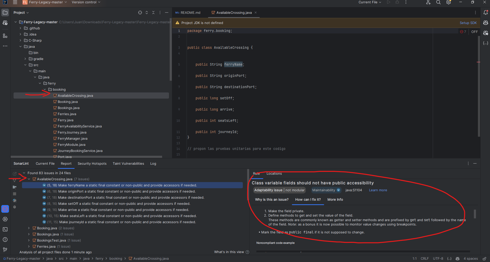
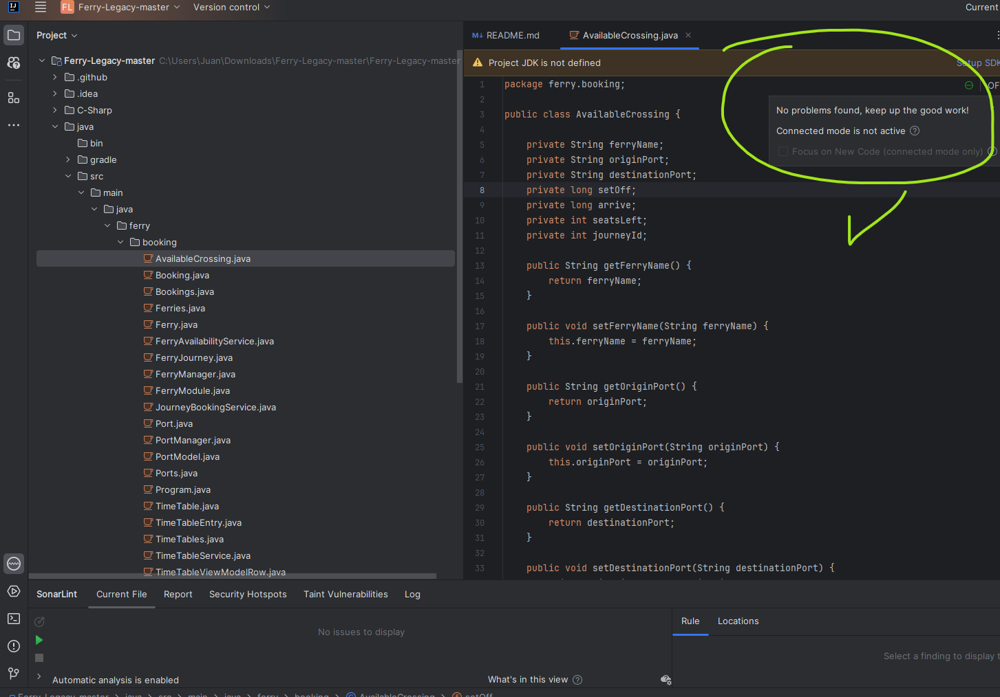

# DevEx + Developer Productivity

1. _Analizar el proyecto teniendo en cuenta las diferentes actividades que se han realizado e identificar puntos positivos o negativos con relación a la experiencia del desarrollador DevEx y la productividad (SPACE), documentar esto en la bitácora. Identificar oportunidades de mejora, algunas métricas identificables y lo que consideren importante con relación a los dos frameworks vistos en clase (DevEX + SPACE)_

2. _Aplicar alguna herramienta AI para poder solucionar temas de malas prácticas en el desarrollo, documentación de código, entendimiento de código, implementación de pruebas unitarias, refactorización o lo que ustedes consideren. Hay muchas herramientas en el mercado, como mínimo utilizar GitHub Copilot o AWS CodeWhisperer  traten de explotar algunas de las características de este y documenten su beneficio y como mejora productividad y experiencia cuando se utilizan._

## Analisis DevEx + SPACE 🚀

### Puntos Positivos
#### **Clase Booking** : 
- La clase Booking utiliza métodos descriptivos y bien estructurados para gestionar las reservas.

- Implementa patrones de diseño que mejoran la escalabilidad y mantenibilidad del código.
#### **Clase FerryManager**
- La clase FerryManager centraliza la lógica de gestión de los ferris, lo que mejora la cohesión y facilita su mantenimiento.
#### **Ferry Journey**
- La clase FerryJourney maneja de manera eficiente la información relacionada con los viajes en los ferris, contribuyendo a la claridad del código.

### Puntos Negativos
#### **Clase AvailableCrossing** 
- La clase AvailableCrossing carece de una descripción clara de su responsabilidad, lo que dificulta la comprensión de su propósito.
- Utiliza tipos primitivos para conceptos complejos, lo que puede llevar a confusión y errores en el código.

#### **Clase FerryAvailabilityService**
- La clase FerryAvailabilityService podría mejorar la captura de excepciones al utilizar excepciones más específicas en lugar de la excepción genérica Exception.
- La carga de datos en el constructor podría hacer que la clase sea menos flexible y difícil de probar en diferentes contextos.

### Oportunidades de Mejora
- Refactorizar la clase Program para seguir principios de diseño sólidos y reducir la complejidad del código.
- Implementar documentación detallada en las clases para mejorar la comprensión de su funcionalidad y responsabilidades.
- Refactorizar la estructura del proyecto para dividirlo en diferentes directorios para su mejor entendimiento : ejemplo estructura MVCS , Modelo, vista, controlador y servicio.

### Métricas Identificables

- Cobertura de Pruebas: Porcentaje de código cubierto por pruebas.
- Calidad del Código: Medida a través de herramientas estándar como SonarLint.
### Consideraciones importantes frameworks DevEx & Space
Al considerar los frameworks DevEx y SPACE, es importante tener en cuenta los siguientes puntos:

#### **DevEx (Developer Experience)** 
Este framework se centra en la experiencia del desarrollador. Busca mejorar la productividad y la satisfacción del desarrollador al proporcionar herramientas, prácticas y procesos que faciliten el desarrollo de software. Algunas consideraciones importantes incluyen la facilidad de uso de las herramientas, la claridad de la documentación, la eficiencia de los procesos de desarrollo y la calidad del soporte.

- Asegurarse de que la documentación de los métodos y clases sea clara y detallada en todo el proyecto.

- Implementar patrones de diseño que fomenten la productividad y la escalabilidad del código.

- Proporcionar herramientas de desarrollo integradas que faciliten la tarea de programar y depuración (IA).

#### **SPACE (Security, Performance, Accessibility, Compatibility, Efficiency)**
 Este framework se centra en cinco áreas clave que son vitales para el desarrollo de software de alta calidad. Al considerar SPACE, es importante evaluar cómo se manejan estas áreas en el proyecto. Por ejemplo, ¿cómo se está abordando la seguridad? ¿Se están realizando pruebas de rendimiento? ¿El software es accesible para todos los usuarios? ¿Es compatible con todos los sistemas operativos y dispositivos objetivo? ¿Se están utilizando los recursos de manera eficiente?
 -  Utilizar herramientas de análisis como SonarQube o SonarLint para detectar vulnerabilidades y errores de seguridad en el código.
 - Garantizar rendimiento de la aplicacion , minimizando recursos y optimizando códigos ineficientes.
## Herramientas AI Utilizadas ⚙️ 

### GitHub Copilot & SonarLint

GitHub Copilot es una herramienta de inteligencia artificial que puede ser de gran ayuda con la IA de Sonarlint para mejorar la productividad en este proyecto ya que este podrá resolver los issues encontrados por SonarLint de simplificando nuestro trabajo en gran medida. 

- GitHub Copilot: Utilizado para autocompletar código, generar documentación, resolver problemas comunes, refactorizar código, generar pruebas y corregir smell codes.

- SonarLint: Utilizado para identificar  smell codes.

###  Beneficios en Productividad y Experiencia

- **Autocompletado de código**: GitHub Copilot puede predecir y sugerir automáticamente el código que el desarrollador podría querer escribir a continuación. Esto puede acelerar el proceso de desarrollo y reducir la cantidad de errores tipográficos o de sintaxis.

- **Generación de documentación**: Copilot puede generar automáticamente comentarios y documentación para el código existente, lo que puede ahorrar tiempo y mejorar la comprensión del código.

- **Resolución de problemas comunes**: Copilot ha sido entrenado en millones de repositorios de código abierto, por lo que puede sugerir soluciones a problemas comunes que han sido resueltos por otros desarrolladores en el pasado.
- **Refactorización**: Copilot puede sugerir formas más eficientes o limpias de escribir el código, lo que puede ayudar a mejorar la calidad del código y reducir la complejidad.

- **Generación de pruebas**: Copilot puede generar automáticamente pruebas unitarias para el código existente, lo que puede ahorrar mucho tiempo y esfuerzo.

- **Corrección de smell codes**: Copilot puede identificar y sugerir correcciones para los smell codes, lo que puede mejorar la legibilidad y mantenibilidad del código.

- **Identificación de errores** :Copilot puede identificar errores en el código y sugerir correcciones, lo que puede ayudar a reducir el tiempo de depuración.
### Uso de las herramientas :
- Abrimos Sonarlint y ubicamos la primera issue, abrimos en el proyecto la clase en que se ubica el issue y copiamos la descripción que nos proporciona el reporte

- Ahora abrimos copilot en la clase que está situada el issue y pegamos en el chat la descripción de el smell code , cuando la ia genere las refactorizaciones revisamos la solución propuesta

- Ahora analizamos rapidamente si sonarlint encuentra de manera especifica smell codes :

- Finalmente volvemos a hacer una analisis general y verificamos que el issue ya esté solucionado:

## Conclusiones
- _En resumen, GitHub Copilot puede ser una herramienta valiosa para mejorar la productividad y la experiencia del desarrollador en este proyecto en compañía de SonarLint ya que este nos detectará los smell codes que hay en el proyecto y Copilot nos ayudará a resolverlos._

- _Por otro lado Copilot Auto generará test para asegurar un coverage del codigo deseado._

